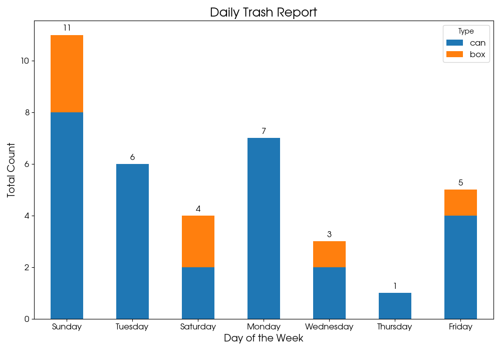

# 공원 무단투기 감시 순찰 로봇 (ROS 2 Humble)

2025-2학기 로봇프로그래밍 프로젝트.
TurtleBot3 Waffle이 Gazebo 공원 맵을 **Nav2로 순찰**하면서, 각 웨이포인트에서 **좌우로 회전 스캔**하고
**YOLOv5**로 쓰레기(캔·박스)를 감지해 **요일별 리포트**를 남깁니다.
리포트가 쌓이면 **쓰레기가 많이 발견된 지점부터 우선 순찰**하도록 경로를 재구성합니다.



> 대용량 Gazebo 모델(`src/my_project_pkg/models/`, 741MB)과 학습 가중치(`best.pt`)는
> GitHub 용량 제한 때문에 이 저장소에 포함하지 않았습니다. 코드·런치·BT·맵·리포트만 올렸습니다.

---

## 1. 시스템 구성

```
                       ┌──────────────────────────┐
   Gazebo (project.world) │  TurtleBot3 Waffle       │  /camera/image_raw, /scan, /odom
                       └──────────┬───────────────┘
                                  │
        ┌─────────────────────────┼─────────────────────────┐
        ▼                         ▼                         ▼
  Nav2 (bringup)          yolo_detector/yolo_node    slam_toolbox (맵 작성 시)
  + scan_bt.xml           /yolo_detections
  (AMCL·planner·controller)   /yolo_image
        ▲                         │
        │ NavigateToPose          ▼
  my_nav2_tools/nav2_patrol ──/waypoint_arrived──▶ my_project_pkg/object_scanner
        ▲                                                   │ /scan_results (JSON)
        │ /scan_done                                        ▼
        └───────────────────────────────────────  my_project_pkg/json_logger
                                                            │ report/<요일>.json
                                                            ▼
                                        create_daily_report.py  (그래프 + 최다 지점)
                                        my_project_pkg/priority_patrol (우선순위 순찰)
```

### 토픽/액션 흐름 (한 웨이포인트 기준)

| 순서 | 주체 | 동작 |
|---|---|---|
| 1 | `nav2_patrol` | `NavigateToPose` goal 전송 (`behavior_tree = scan_bt.xml`) |
| 2 | Nav2 (BT) | 목표 도착 → `Wait 1s` → 좌45° → 우45° → 우45° → 좌45° 회전 스캔 |
| 3 | `nav2_patrol` | goal SUCCEEDED → `/waypoint_arrived` (wp번호) 발행 후 **대기** |
| 4 | `object_scanner` | 0.5s 뒤 2초간 `/yolo_detections` 관찰, 클래스별 **최대 동시 감지 수** 집계 |
| 5 | `object_scanner` | `/scan_results` (JSON) + `/scan_done` (wp번호) 발행 |
| 6 | `json_logger` | `/scan_results` → `report/<요일>.json`의 `results[]`에 append |
| 7 | `nav2_patrol` | `/scan_done` 수신 → 다음 wp로 (타임아웃 20s, 실패 시 2회 재시도 후 스킵) |

---

## 2. 패키지 구조

```
ros2_project_ws/
├── src/
│   ├── my_project_pkg/          # 메인 패키지 (월드·런치·스캐너·로거·우선순위 순찰)
│   │   ├── launch/
│   │   │   ├── my_project.launch.py        # Gazebo + project.world + Waffle 스폰
│   │   │   ├── patrol_and_scan.launch.py   # yolo_node + object_scanner + json_logger + nav2_patrol
│   │   │   └── priority_patrol.launch.py   # 위와 동일하되 nav2_patrol → priority_patrol
│   │   ├── my_project_pkg/
│   │   │   ├── object_scanner.py           # 스캔 윈도우 동안 can/box 카운트
│   │   │   ├── json_logger.py              # /scan_results → 요일별 JSON
│   │   │   ├── priority_patrol.py          # 리포트 분석 → 쓰레기 많은 wp 우선 순찰
│   │   │   └── object_scanner_action_server.py  # (실험) /scan_scene 액션 서버 버전
│   │   ├── worlds/project.world            # 공원 맵 (벤치·나무·쓰레기 배치)
│   │   ├── worlds/maps/park1~7.world       # 요일별 쓰레기 배치가 다른 월드
│   │   ├── params/my_waffle_params.yaml
│   │   └── models/  (git 제외)             # Gazebo 모델 (tree, bench, bush, 사람 등)
│   ├── my_nav2_tools/
│   │   └── my_nav2_tools/
│   │       ├── nav2_patrol.py              # 4개 wp 순찰 + 스캔 게이트 + 재시도 로직
│   │       └── cylinder_classifier.py      # (초기 실험) OpenCV 색상 기반 실린더 분류
│   ├── clean_nav_pkg/
│   │   ├── behavior_trees/
│   │   │   ├── scan_bt.xml                 # ★ 도착 후 좌우 회전 스캔 BT
│   │   │   ├── patrol_bt.xml               # 순찰 전용 BT (복구 동작 포함)
│   │   │   └── my_nav_to_pose_bt.xml
│   │   ├── launch/nav_launch.py            # nav2_bringup + rviz + nav2_patrol
│   │   └── params/nav_params.yaml          # Nav2 파라미터 (AMCL, DWB, inflation 등)
│   ├── yolo_detector/
│   │   └── yolo_detector/
│   │       ├── yolo_node.py                # YOLOv5 커스텀 모델 → /yolo_detections, /yolo_image
│   │       └── person_counter_node.py      # 감지 결과에서 사람 수 → /person_count
│   └── my_tb3_description/urdf/            # 카메라 위치 수정한 Waffle URDF
├── report/<요일>.json                       # 요일별 스캔 결과 (7일치)
├── create_daily_report.py                   # JSON → 스택 막대그래프 + 최다 무단투기 지점
├── daily_trash_report.png
├── day_1~7.pgm/.yaml                        # SLAM으로 작성한 맵 (시도별)
├── navigate_to_pose_w_replanning_and_recovery.xml  # Nav2 기본 BT (참고용 원본)
└── docs/
    ├── commands.md                          # 실행 명령어 모음
    └── setup.md                             # 환경 설정 (.bashrc 등)
```

---

## 3. 실행 방법

```bash
# 0) 빌드
cd ~/ros2_project_ws
PYTHONNOUSERSITE=1 colcon build --symlink-install   # 의존성 충돌 시 PYTHONNOUSERSITE=1
source install/setup.bash

# 1) Gazebo 월드 + 로봇
ros2 launch my_project_pkg my_project.launch.py

# 2) Nav2 (맵 지정)
ros2 launch clean_nav_pkg nav_launch.py use_sim_time:=True map:=$HOME/ros2_project_ws/day_7.yaml
#   또는 turtlebot3 기본 런치:
ros2 launch turtlebot3_navigation2 navigation2.launch.py use_sim_time:=True map:=$HOME/ros2_project_ws/day_7.yaml

# 3) RViz에서 2D Pose Estimate로 초기 위치 지정 후, 순찰+스캔
ros2 launch my_project_pkg patrol_and_scan.launch.py output_filename:=월요일.json

# 4) 리포트 생성 (요일별 JSON → 그래프)
python3 create_daily_report.py

# 5) 우선순위 순찰 (리포트 기반)
ros2 launch my_project_pkg priority_patrol.launch.py
```

자세한 명령어는 [docs/commands.md](docs/commands.md) 참고.

---

## 4. 진행 과정 / 설계 결정

1. **맵 작성** — `turtlebot3_gazebo` 하우스 맵으로 SLAM(`slam_toolbox`) 연습 후, 직접 만든 공원 월드(`project.world`)에서 `map_saver_cli`로 맵 저장 (`day_*.pgm`).
2. **순찰 노드** — `NavigateToPose` 액션 클라이언트로 4개 웨이포인트 순회. 처음엔 `waypoint_follower`를 고려했으나, 웨이포인트마다 스캔을 끼워 넣어야 해서 직접 goal을 순차 전송하는 방식으로 변경.
3. **스캔 동작을 BT로** — 도착 후 회전 스캔을 파이썬 노드에서 `cmd_vel`로 하지 않고, Nav2 BT(`scan_bt.xml`)의 `Spin` 노드로 구현. goal에 `behavior_tree` 필드를 지정하면 Nav2가 해당 BT를 사용.
4. **객체 감지** — 처음엔 OpenCV HSV 색상 기반(`cylinder_classifier.py`)으로 실린더를 분류했으나, 실제 쓰레기(캔/박스) 모델을 감지하기 위해 **YOLOv5 커스텀 학습**(`best.pt`)으로 전환. 화면의 30% 이상을 차지하는 박스는 오탐으로 필터링.
5. **카운팅 방식** — 프레임마다 누적하면 같은 물체가 중복 집계되므로, 스캔 윈도우 동안 **프레임당 최대 동시 감지 수**를 취함. (IoU 기반 고유 객체 추적도 검토했으나 단순화)
6. **동기화** — `nav2_patrol` ↔ `object_scanner`를 `/waypoint_arrived` / `/scan_done` 토픽으로 핸드셰이크. 스캔 결과가 안 오면 20초 타임아웃 후 진행.
7. **요일별 시나리오** — `park1~7.world`로 요일별 쓰레기 배치를 다르게 하여 7일치 리포트 생성 → `create_daily_report.py`로 시각화.
8. **우선순위 순찰** — 누적 리포트에서 wp별 쓰레기 합계를 계산해 내림차순으로 순찰 순서 결정 (`priority_patrol.py`).

---

## 5. 알려진 이슈 / Jazzy 마이그레이션 시 수정할 것

- `nav2_patrol.py`, `priority_patrol.py`, `yolo_node.py`, `json_logger.py`에 **절대 경로가 하드코딩**되어 있음
  (`/home/suhyeong/ros2_project_ws/...`, `/home/suhyeong/yolov5`, `~/Desktop/best.pt`). → `get_package_share_directory` / 파라미터로 바꿔야 함.
- `my_project.launch.py`는 **Gazebo Classic**(`gazebo_ros`, `spawn_entity.py`) 기반. Ubuntu 24.04 + Jazzy에서는 **Gazebo Harmonic**(`ros_gz_sim`)으로 전환 필요.
- `nav_params.yaml`은 Humble 기준. Jazzy Nav2에서 일부 파라미터 이름 변경됨 (예: `bt_navigator`의 BT 플러그인 목록).
- YOLOv5 커스텀 가중치 `best.pt`는 저장소에 없음 → 재학습 또는 별도 보관본 사용.
